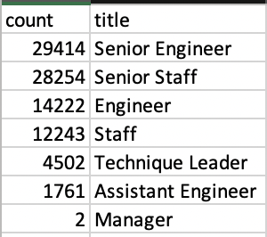
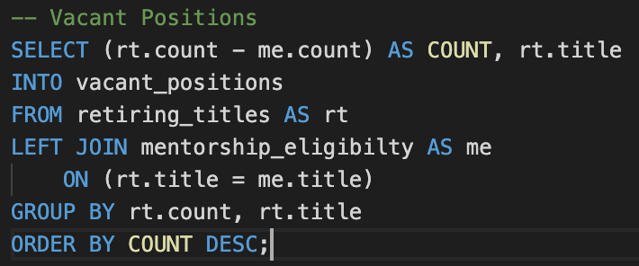
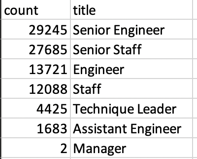
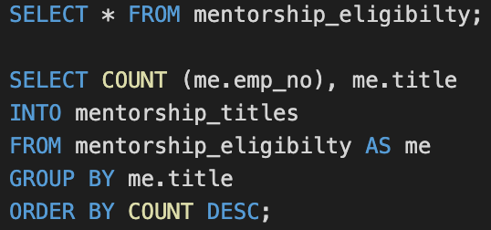
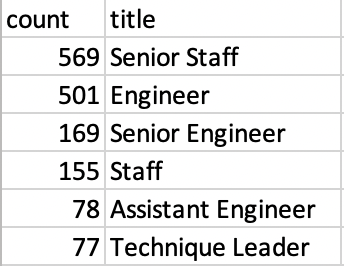

# Pewlett Hackard Analysis

## Overview of the Analysis

In this analysis, I help Pewlett Hackard, a large company with several thousand employees that have been around for a long time to figure out two upcoming problems: one, a retirement package for those eligible to retire, and two, the number of vacant positions it will need to fill. I extract the raw data from 6 CSV files provided by the company to build tables using SQL to analyze the data. I analyze by providing the number of retiring employees by title and those employees that are eligible for the mentorship program. Lastly, I conclude the analysis by providing two insights to two questions;

1. How many roles will need to be filled as the "silver tsunami" begins to make an impact?
2. Are there enough qualified, retirement-ready employees in the departments to mentor the next generation of Pewlett Hackard employees?

### Objective of the Analysis 

Companies are facing a grave challenge with the number of baby boomers coming to retirement age, companies have to figure out ways to fill their positions with less experienced, but exuberant young employees. That is why, at Pewlett Hackard I am helping them figure out the number of people coming to retirement age, and before they actually retire the company wants to transfer their expertise to younger employees through a mentorship program.

## Results 

In this section I summarize four major points about the analysis. 

*  I count the number of people retiring according to their title using the DISTINCT ON function in SQL. This function allows me to retrieve the latest job title the employees worked under. I find that the total number of retiring employees is 90,398. I find that Senior Engineers are the most number of employees that are retiring with the least being managers. 

	

	**Table 1: Retiring Employees according to Title**

* The number of employees that are eligible for mentorship is 1,549. This means that there are more than enough retiring employees to provide mentorship. The mentorship program can be sketched in such a way that employees who are planning to change their job titles can be accordingly matched.

* The mentorship program is provided to the employees at the age of 56, and the age of the possible mentors is between the ages of 66 and 69.

* Using SQL I condensed the 6 CSV files into 6 concise and insightful CSV files that helped me summarize questions Pewlett Hackard faced. These queries for these data files can be found in the query folder under the name "Employee_Database_challenge". I found SQL a handy tool to analyze data much faster compared to Excel.

## Summary 

In this section I concluded this analysis by answering the two questions I quoted above. 

1. How many roles will need to be filled as the "silver tsunami" begins to make an impact?
	*  The number of people retiring is much more than the people that are eligible for the mentorship program which means if not planned correctly there will be a lot of vacant positions. Since the 'silver tsunami' is described for baby boomers aging 65 or older, Pewlett Hackard will need to find qualified employees for the 88,849 employees that are aged between 66 and 69 after placing the employees in the mentorship program. I found the number of vacant positions according to job title by running the query in graph 1. Table two is the result after subtracting the number of retiring employees and employees that qualify for mentorship.
	
		
		**Graph 1: Query to Find the Number of Vacant Positions**
		
		
		
		**Table 2: Vacant Positions according to Title**
		

	

2. Are there enough qualified, retirement-ready employees in the departments to mentor the next generation of Pewlett Hackard employees? 

	* Counting the number of mentorship eligible employees according to job title I get the result in table 2. If the mentorship program is intended to fill in the vacant positions after the employees go through the mentorship program; one, the age bracket for the employees eligible to the mentorship program can be broadened, two, more people can be hired to be included in the mentorship program. Or else, there will a large number of vacant positions open.  
		
		 
		
		**Graph 2: Query to Find the Number of Employees Eligible for Mentorship**

		
		 
		
	

		**Table 3: Mentorship Eligible Employees according to Title**

